# Architecture Orientation — `opticore-news-demo`

Diagram-first map of the app. (Mermaid renders in GitHub / VS Code with a Mermaid extension.)

---

## 1. The layered dependency chain

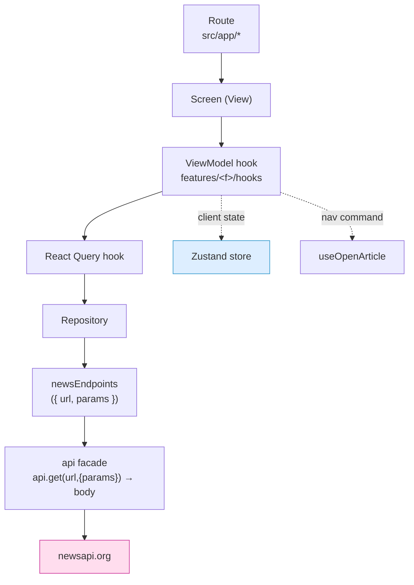

**Golden rules:** a screen is a thin **View** that binds one **ViewModel** and never calls a query
hook / store / `useRouter` / repository directly · the repository is the only file that knows
newsapi's response shape · `newsEndpoints` is the only file that defines paths/query params.

---

## 2. Five layers, one direction

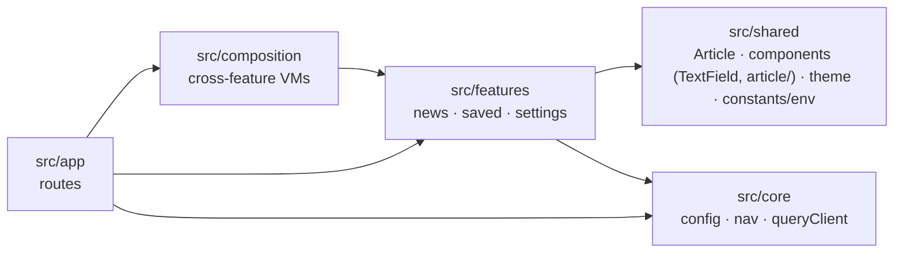

Imports flow **app → composition → features → shared/core**. Shared & core never import features;
features never import each other — cross-feature wiring lives in `src/composition`.

---

## 3. Boot sequence

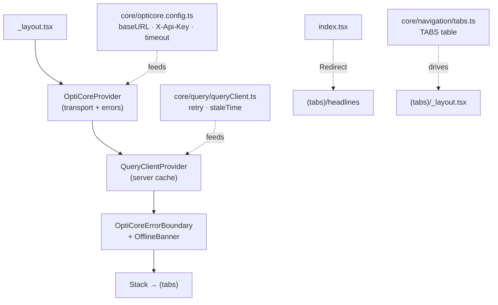

Provider order matters: **OptiCore wraps React Query** (retry logic depends on `ApiError`).

---

## 4A. Headlines — the canonical read path

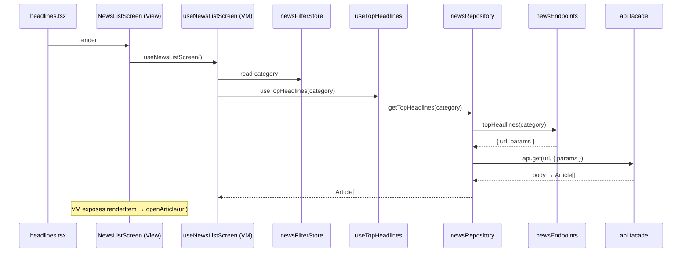

The View only destructures the VM and renders; `renderItem` stays in the View.

---

## 4B. Search — read path + debounced local input

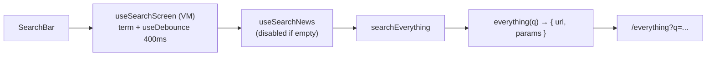

Search term + debounce live in the **ViewModel** (local state, not a store). No request until the
box is non-empty.

---

## 4C. Article detail — cross-feature composition

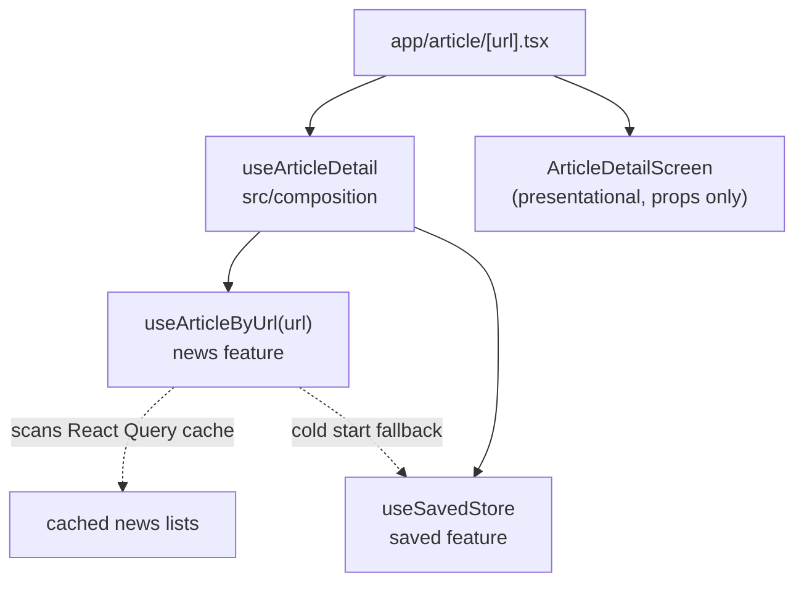

No get-by-id on newsapi → reuse cached list data. Composition lives in `src/composition`
(above features, below the route) because `news` and `saved` never import each other; the screen
imports neither store.

---

## 4D. Saved — store-only feature (no API)

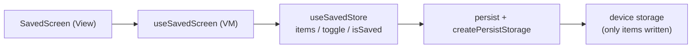

---

## 4E. Settings — form + theme + preferences

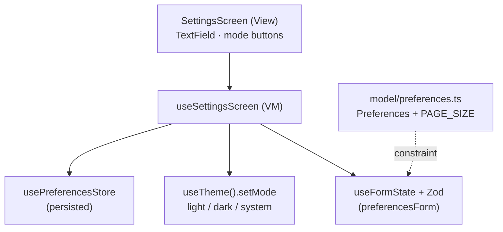

The **VM owns validation** (the Zod form schema lives with `useSettingsScreen`, referencing the
domain constraint `PAGE_SIZE` from `model/`). The View binds only to the VM — it never touches
React Hook Form or the theme manager. The form is built from the shared `TextField`. Also wired
globally: an **offline banner** (`useConnectivity`) in `_layout`, and a two-column tablet grid in
the news list (`useResponsive`).

---

## 5. Two state systems — never mix

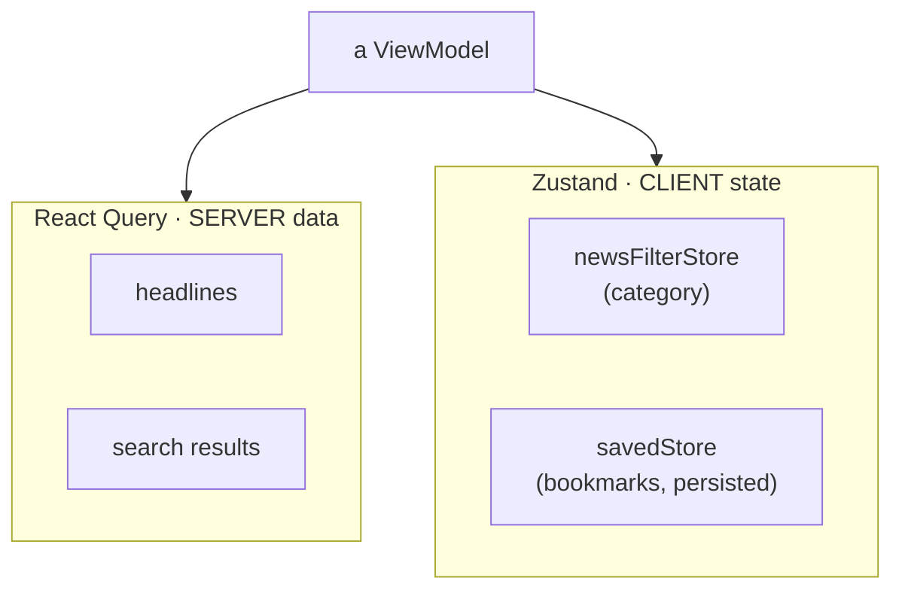

Fetched data → React Query. UI/local/persisted client state → Zustand. Never the reverse.

---

## 6. Feature internals & public surface

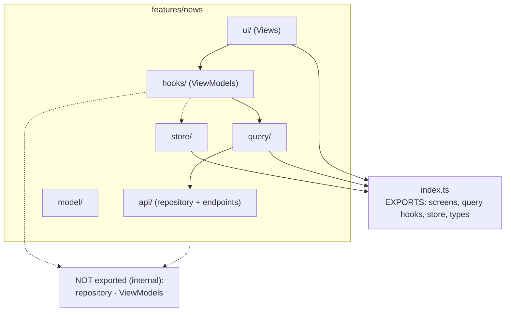

Consumers import from the feature root `index.ts` — never deep paths, never the repository or VMs.

---

## 7. OptiCore touch points

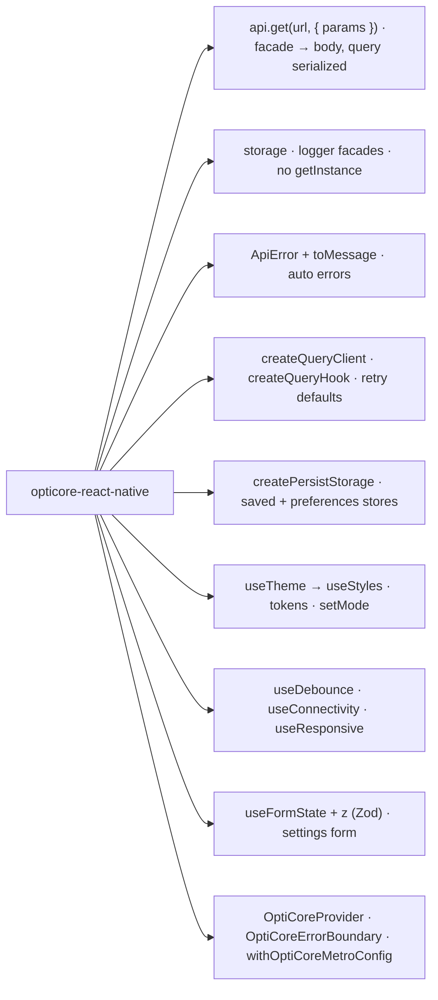

**Facade-only:** app code uses the `api` / `storage` / `logger` facades — never `.getInstance()`.
`api` verbs return the response **body** directly (`api.get<Article[]>(...)`), and passing `params`
lets the client serialize the query string, so call sites never build URLs by hand. Drop to the
singletons only for rare advanced config (custom interceptors).

---

## 8. "Where do I put…?"

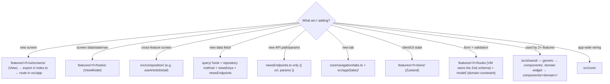

> Empty scaffold dirs (`shared/utils`, `shared/repositories`, `features/*/utils`) are intentional
> placeholders showing where things go — keep the shape consistent when adding a feature.

---

## 9. Tests mirror `src/`

```
test/features/news/api/newsRepository.test.ts      → body → Article[] mapping
test/features/news/query/useTopHeadlines.test.tsx  → hook wiring
test/features/news/store/newsFilterStore.test.ts   → store transitions
```

---

## 10. Commands

```bash
npm install                      # install (no flag needed)
npm start                        # expo start  ·  npm run ios | android | web
npm run lint                     # expo lint
npx tsc --noEmit                 # type-check (strict, keep at 0)
npm test                         # jest
```

Needs `EXPO_PUBLIC_NEWS_API_KEY` in `.env` (Expo only inlines `EXPO_PUBLIC_*` into the client; it's
read once in `shared/constants/env.ts` and exposed app-wide as `NEWS_API_KEY`). Targets **Expo SDK
54** (dev-only; newsapi free tier authorizes localhost only). Don't bump SDK/native modules without intent.

---

### First-session reading order

`_layout.tsx` → `headlines.tsx` → `NewsListScreen` (View) → `useNewsListScreen` (ViewModel) →
`useTopHeadlines` → `newsRepository` → `newsEndpoints` → `composition/useArticleDetail` →
`article/[url].tsx` → `savedStore.ts` → `settings/useSettingsScreen` (forms + theme). That covers
every pattern.
